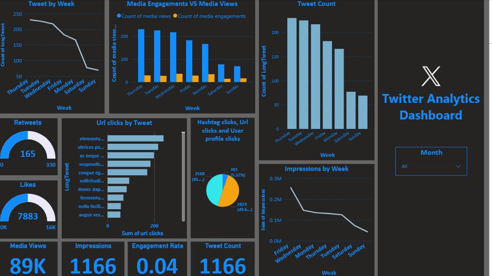

# 📊 Twitter Tweets Analysis Dashboard (Power BI)
An end-to-end Twitter Analytics Dashboard built using Power BI and DAX, designed to track tweet performance, user engagement, and content reach through interactive visual reporting.

# 🚀 Project Overview
Social media platforms generate massive engagement data, but raw tweet metrics are difficult to interpret quickly.
This project transforms Twitter tweet data into a dynamic Power BI dashboard to help analyze:
Tweet impressions
Engagement rate
Media views
Likes, retweets, replies
Content performance trends

# 🎯 Key Features
📌 Interactive dashboard with slicers and filters
📈 Tweet-level engagement and reach analysis
🧮 Custom DAX measures for KPI calculations
🔍 Drill-through insights for top-performing tweets
⚡ Reduced reporting time by ~50% through automation

# 🛠️ Tech Stack
Power BI – Data visualization & dashboard creation
DAX (Data Analysis Expressions) – Calculated measures & KPIs
Excel / CSV Dataset – Tweet metrics input
Data Modeling – Relationship building & structured reporting

# 📊 Dashboard Insights
The dashboard provides real-time insights such as:
Engagement rate trends over time
Most viewed and most interacted tweets
Media vs non-media performance comparison
Tweet activity patterns by date and time

# 🧠 DAX Measures Implemented
Some key calculations include:
Total Impressions
Engagement Rate (%)
Media Engagements
Average Reach per Tweet
Tweet Performance Score

# 🌍 Real-World Impact
Enabled faster decision-making for content strategy
Automated tweet performance reporting
Helped identify high-performing campaigns and engagement drivers
Improved analytics efficiency by reducing manual tracking effort

# 📂 Project Structure
📁 Twitter-Tweets-Analysis-Dashboard
 ┣ 📄 project1.pbix
 ┣ 📄 Tweet.xlsx
 ┣ 📄 README.md
 ┗ 📄 analyticdashboard.png

# 📸 Dashboard Preview

# 📌 How to Use
Download the .pbix file from this repository
Open it in Power BI Desktop
Load the dataset (Excel/CSV) if required
Explore insights using interactive filters
